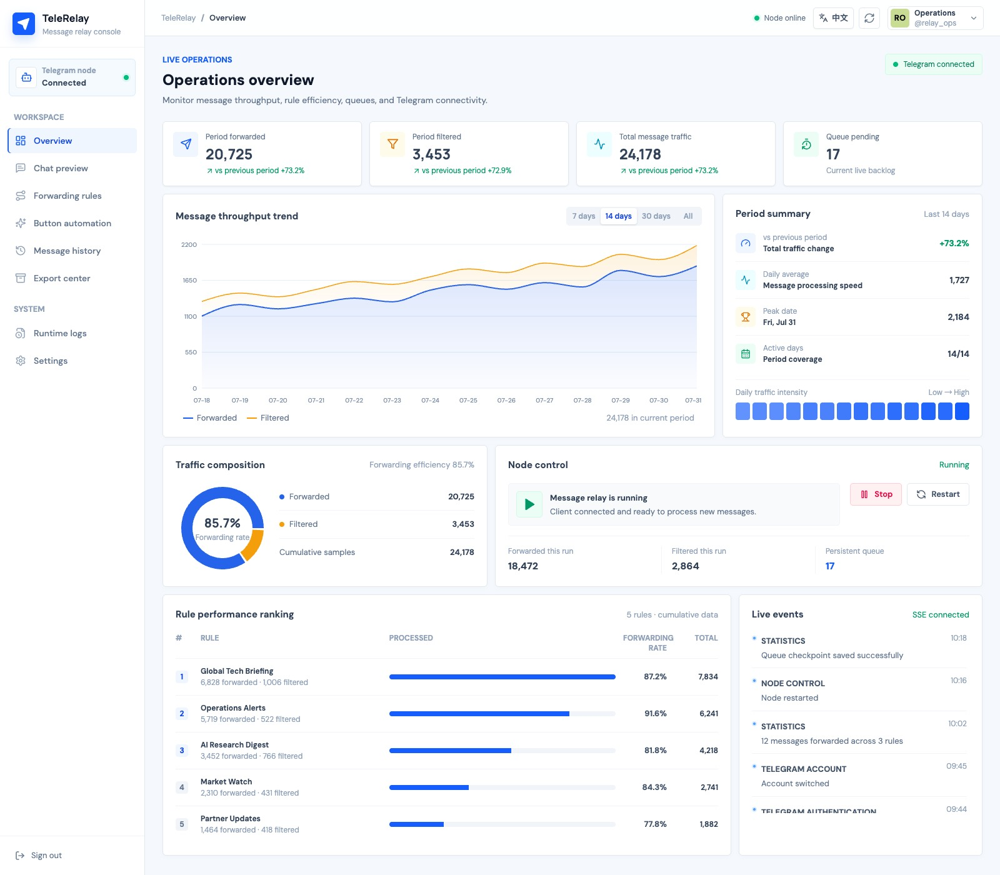

[中文文档](README_zh.md)

# TeleRelay

An intelligent Telegram message relay tool with smart filtering based on regex patterns and keywords, featuring a modern Web management interface.

<p align="center">
  
</p>

## Preview

<p align="center">
  
</p>

## Features

- Multi-rule forwarding with source, target, filter, ignore, and forwarding options
- Persistent SQLite queue with retry, FloodWait handling, and restart recovery
- User session and Bot Token modes
- Parallel multi-account runtimes in User mode
- Exact, contains, and regex callback-button automation
- JSON, CSV, SQLite, and offline HTML exports
- Hourly, daily, and weekly incremental export tasks
- Live runtime status and logs over SSE
- HTTP Basic Auth for API and console
- Optional Telegram Admin Bot

## Architecture

Single-service deployment:

- `backend/`: FastAPI, Telethon runtime, application services, SQLite stores, REST/SSE API
- `frontend/`: React 19, TypeScript, Vite, TanStack Query, Recharts, i18next
- FastAPI serves `frontend/dist` in production
- Uvicorn runs with one worker

REST endpoints: `/api/v1`. OpenAPI docs: `/api/docs`. SSE stream: `/api/v1/events`.

## Quick Start

### Configuration

```bash
cp .env.example .env
```

Set `API_ID` and `API_HASH` in `.env`. For Bot mode, also set `BOT_TOKEN`. Enable `WEB_AUTH_USERNAME` and `WEB_AUTH_PASSWORD` when the console is network-accessible.

Telegram API credentials: [my.telegram.org](https://my.telegram.org). Bot tokens: [@BotFather](https://t.me/BotFather).

### Docker Compose

```bash
docker compose up -d --build
```

Open `http://localhost:8080`. Configuration, sessions, databases, exports, and logs persist through `config/`, `data/`, and `logs/` mounts.

### Local Build

Requires Python 3.11+, Node.js 22+, and pnpm. `uv` is recommended for local development.

```bash
python -m venv .venv
source .venv/bin/activate
pip install -r requirements.txt
pnpm install --frozen-lockfile
pnpm --dir frontend build
python -m backend.main
```

Open `http://localhost:8080`.

### Local Development

```bash
pnpm dev
```

This uses `uv` to prepare Python dependencies and `concurrently` to manage both servers. Backend code changes trigger Uvicorn reloads, while Vite HMR updates the frontend immediately. Vite defaults to `http://localhost:5173` and selects the next available port when needed; `/api` is proxied to the backend port configured by `WEB_PORT` in the root `.env` file. Make sure another development environment is not already running before starting it.

Use `pnpm dev:backend` and `pnpm dev:frontend` to run either side separately.

## Configuration

`.env` — credentials and runtime settings: API credentials, `SESSION_TYPE`, proxy, host, port, log level, runtime language, Web Basic Auth, Admin Bot and Mini App settings.

`config/<telegram_user_id>.yaml` is generated after account authentication and managed by the console. It stores forwarding rules, button automation, filters, and export settings for that account.

The console can import/export YAML config. `.env` secrets are never included.

## Data

```text
config/<telegram_user_id>.yaml             # Account configuration
data/telegram_accounts.json                # Global account registry
data/<telegram_user_id>/telegram.session   # Telegram session
data/<telegram_user_id>/forward_queue.db   # Forwarding queue
data/<telegram_user_id>/stats.db           # Statistics and history
data/<telegram_user_id>/exports.db         # Export tasks and runs
data/<telegram_user_id>/db/                # Message archives
data/<telegram_user_id>/exports/           # Generated files
data/<telegram_user_id>/avatar.jpg         # Account avatar
logs/telerelay.log                          # Rotating log
```

Back up `config/`, `data/`, and `.env` together. `.env` and session files are secrets.

## User Mode

With `SESSION_TYPE=user`, add and authenticate accounts from the account menu. Each account gets an isolated client, auth state, and forwarding queue, all running concurrently on the event loop.

With `SESSION_TYPE=bot`, configure `BOT_TOKEN`. Button automation and account-wide export discovery require User mode.

## Admin Bot

Set `ADMIN_BOT_TOKEN` and `ADMIN_CHAT_ID`:

- `/status`
- `/bot start|stop|restart`
- `/rule list|detail|add|del|rename|toggle|set`
- `/webapp`

The Admin Bot uses a separate token.

## Development Checks

```bash
PYTHONPYCACHEPREFIX=/tmp/telerelay-pyc .venv/bin/python -m compileall -q backend tests
.venv/bin/python -m unittest discover -s tests -v
cd frontend && pnpm run build
```

## Project Structure

```text
telerelay/
├── backend/              # FastAPI and Telegram runtime
│   ├── api/              # REST and SSE routes
│   ├── exporter/         # Export engine and scheduler
│   ├── forwarder/        # Forwarding pipeline
│   ├── schemas/          # HTTP request contracts
│   ├── services/         # Application services
│   └── main.py           # Entry point
├── frontend/             # React + TypeScript console
│   └── src/
├── data/                 # Sessions, databases, exports
├── logs/                 # Rotating logs
├── tests/
├── Dockerfile
└── docker-compose.yml
```

## Security

- Enable Web Basic Auth whenever port 8080 is network-accessible.
- Terminate HTTPS at a reverse proxy; never send Basic Auth over plain HTTP.
- Uvicorn must run with one worker.

## License

[MIT License](LICENSE)
