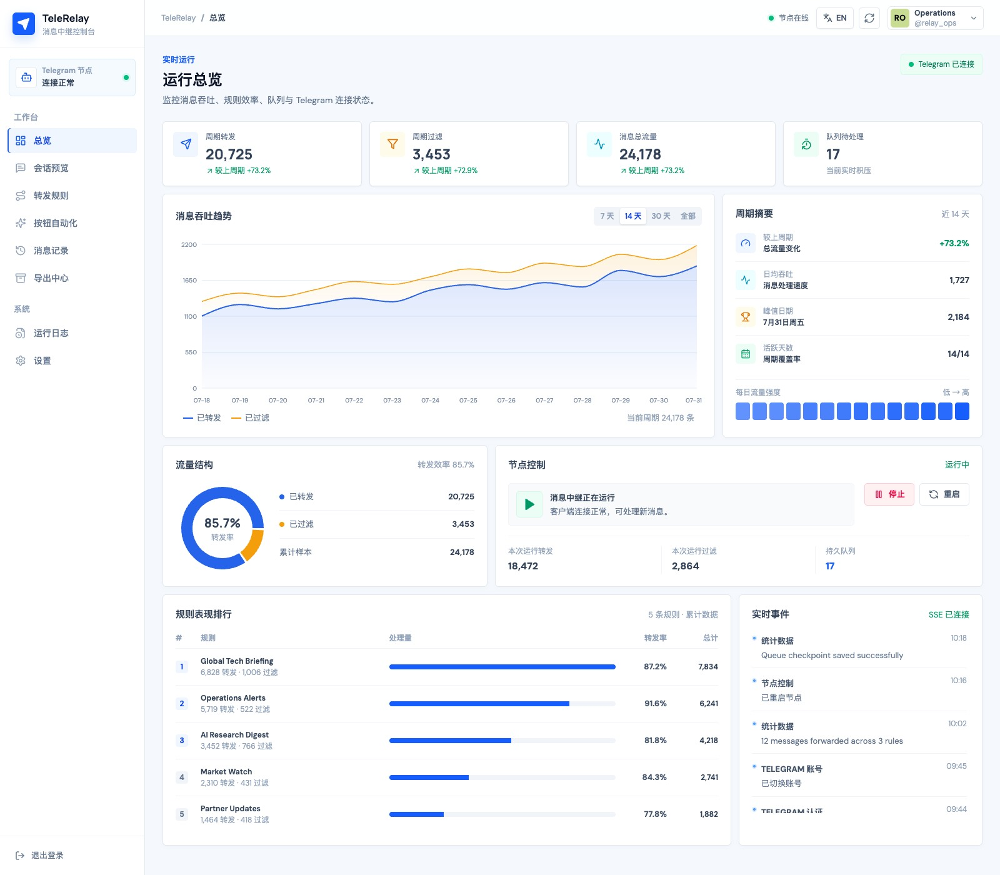

[English](README.md)

# TeleRelay

强大的 自托管 Telegram 消息转发与归档工具。支持基于正则表达式和关键词的灵活过滤，提供现代化的 Web 管理界面

<p align="center">
  
</p>

## 预览

<p align="center">
  
</p>

## 功能

- 多规则转发，分别配置来源、目标、过滤、忽略及转发选项
- SQLite 持久化队列，支持重试、FloodWait 和重启恢复
- User Session 与 Bot Token 两种模式
- User 模式下多账号并行运行
- 精确、包含、正则匹配回调按钮自动化
- JSON、CSV、SQLite、离线 HTML 导出
- 按小时、天、周执行增量导出
- SSE 实时推送运行状态和日志
- HTTP Basic Auth
- 可选 Telegram 管理 Bot

## 架构

单服务部署：

- `backend/`: FastAPI、Telethon 运行时、应用服务、SQLite 存储、REST/SSE API
- `frontend/`: React 19、TypeScript、Vite、TanStack Query、Recharts、i18next
- 生产环境由 FastAPI 托管 `frontend/dist`
- Uvicorn 固定单 worker

REST API: `/api/v1`。OpenAPI 文档: `/api/docs`。SSE: `/api/v1/events`。

## 快速开始

### 配置

```bash
cp .env.example .env
cp config/config.yaml.example config/config.yaml
```

在 `.env` 中设置 `API_ID` 和 `API_HASH`。Bot 模式还需 `BOT_TOKEN`。控制台可被外部访问时，设置 `WEB_AUTH_USERNAME` 和 `WEB_AUTH_PASSWORD`。

Telegram API 凭据: [my.telegram.org](https://my.telegram.org)。Bot Token: [@BotFather](https://t.me/BotFather)。

### Docker Compose

```bash
docker compose up -d --build
```

打开 `http://localhost:8080`。配置、session、数据库、导出文件和日志通过 `config/`、`data/`、`logs/` 挂载持久化。

### 本地构建

需要 Python 3.11+、Node.js 22+、pnpm。本地开发推荐安装 `uv`。

```bash
python -m venv .venv
source .venv/bin/activate
pip install -r requirements.txt
pnpm install --frozen-lockfile
pnpm --dir frontend build
python -m backend.main
```

打开 `http://localhost:8080`。

### 本地开发

```bash
pnpm dev
```

该命令通过 `uv` 准备 Python 依赖，并由 `concurrently` 同时管理后端和前端。后端代码变更会触发 Uvicorn 自动重载，前端由 Vite HMR 即时更新。Vite 默认在 `http://localhost:5173` 提供服务，端口被占用时会自动顺延；`/api` 根据根目录 `.env` 的 `WEB_PORT` 代理到后端。启动前请确保没有重复运行开发环境。

也可以用 `pnpm dev:backend`、`pnpm dev:frontend` 分别启动。

## 配置

`.env` — 凭据和运行参数：API 凭据、`SESSION_TYPE`、代理、地址、端口、日志级别、运行时语言、Web Basic Auth、管理 Bot 和 Mini App 设置。

`config/config.yaml` — 可变应用配置：转发和按钮规则、过滤和转发选项、队列设置、导出目录、时区、并发数。

控制台可导入导出 YAML 配置，`.env` 不包含在内。

## 数据

```text
data/telegram_session.session    # 默认账号 session
data/telegram_sessions/          # 其他账号 session
data/telegram_accounts.json      # 账号注册表
data/telegram_avatars/           # 头像缓存
data/forward_queue.db            # 默认账号队列
data/forward_queues/             # 其他账号队列
data/stats.db                    # 转发统计
data/exports.db                  # 导出任务
data/db/msg_export_{chat_id}.sqlite3
data/exports/                    # 生成文件
logs/telerelay.log               # 轮转日志
```

一起备份 `config/`、`data/` 和 `.env`。`.env` 和 session 文件均为敏感信息。

## User 模式

`SESSION_TYPE=user` 时，从账号菜单添加并认证账号。每个账号有独立 client、认证状态和转发队列，在同一事件循环中并行运行。

`SESSION_TYPE=bot` 时配置 `BOT_TOKEN`。按钮自动化和账号级导出需要 User 模式。

## 管理 Bot

设置 `ADMIN_BOT_TOKEN` 和 `ADMIN_CHAT_ID`：

- `/status`
- `/bot start|stop|restart`
- `/rule list|detail|add|del|rename|toggle|set`
- `/webapp`

管理 Bot 使用独立 Token。

## 开发检查

```bash
PYTHONPYCACHEPREFIX=/tmp/telerelay-pyc .venv/bin/python -m compileall -q backend tests
.venv/bin/python -m unittest discover -s tests -v
cd frontend && pnpm run build
```

## 项目结构

```text
telerelay/
├── backend/              # FastAPI 与 Telegram 运行时
│   ├── api/              # REST 与 SSE 路由
│   ├── exporter/         # 导出引擎与调度器
│   ├── forwarder/        # 转发流水线
│   ├── schemas/          # HTTP 请求契约
│   ├── services/         # 应用服务
│   └── main.py           # 入口
├── frontend/             # React + TypeScript 控制台
│   └── src/
├── config/               # YAML 配置
├── data/                 # Session、数据库、导出文件
├── logs/                 # 轮转日志
├── tests/
├── Dockerfile
└── docker-compose.yml
```

## 安全

- 8080 端口可被外部访问时必须启用 Web Basic Auth。
- 通过反向代理提供 HTTPS，禁止公网明文 HTTP 传输 Basic Auth。
- Uvicorn 必须保持单 worker。

## 许可证

[MIT License](LICENSE)
